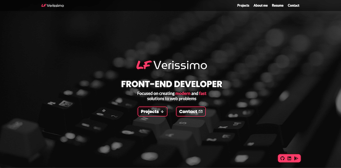
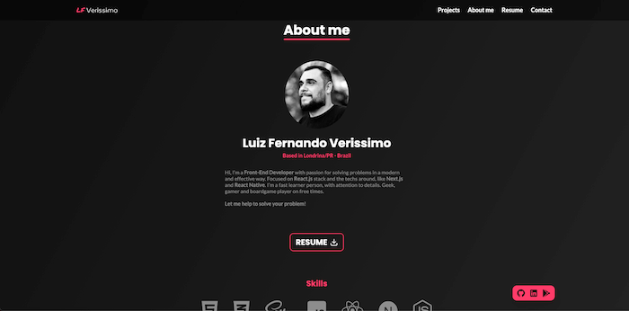
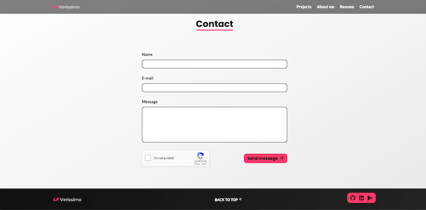

<p align="center">
  
</p>
<h1 align="center">Portfolio 💼 - version </h1>
<p>
  
</p>

>Personal Portfolio version 3, created with React and  Next.js.

### 🏠 [Homepage](https://github.com/luizfverissimo/portfolio-3)

### ✨ [Live](lfverissimo.com)

## Screenshots
<iframe width="640" height="360" src="https://www.youtube.com/embed/DQTS5vdQAok" title="YouTube video player" frameborder="0" allow="accelerometer; autoplay; clipboard-write; encrypted-media; gyroscope; picture-in-picture" allowfullscreen></iframe>

   
## Install

```sh
yarn # or npm install
```

## Usage

```sh
yarn dev # or npm run dev
```

## Author

👤 **LF Verissimo**

* Website: https://lfverissimo.com
* Github: [@luizfverissimo](https://github.com/luizfverissimo)
* LinkedIn: [@lfverissimo](https://linkedin.com/in/lfverissimo)

## Show your support

Give a ⭐️ if this project helped you!

***
_This README was generated with ❤️ by [readme-md-generator](https://github.com/kefranabg/readme-md-generator)_